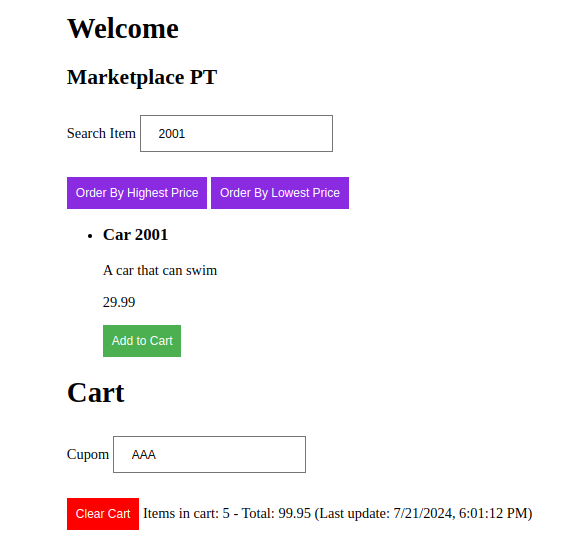

# html-marketplace

Basic HTML marketplace

## Result 1

## Result 2

Concepts used:

1. DOM manipulation
2. for loops
3. forEach()
4. filter()
5. map()
6. find()
7. localStorage
8. JSON manipulation
9. reduce()
10. sort()